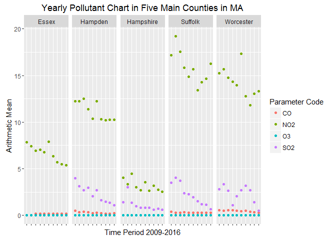
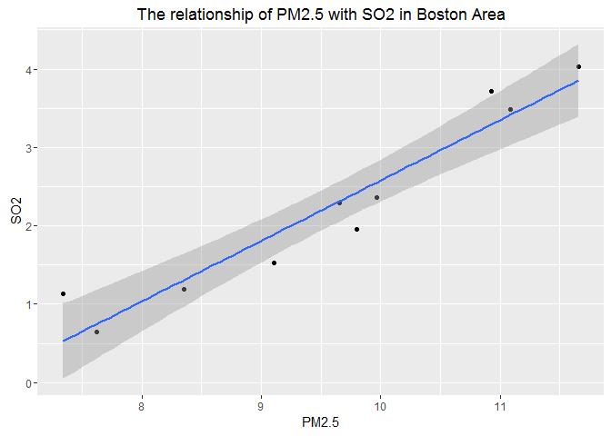

# Data Incubator Project
Zhi Liu  
October 30, 2016  


## R Markdown

This is a Project to analyze air pollutants in USA in past ten years. The data with 6 main pollutants accrossing the whole country were downloaded from United States Environmental Protection Agency website. Massachusetts and Boston were used as representative to analyze the pollutant alteration and their relationship from 2006-2015.

##The data list for analysis

```r
setwd("e:/r/dataincubator/201610/q3/Airquality")
dir()
```

```
##  [1] "daily_42101_2006.csv" "daily_42101_2007.csv" "daily_42101_2008.csv"
##  [4] "daily_42101_2009.csv" "daily_42101_2010.csv" "daily_42101_2011.csv"
##  [7] "daily_42101_2012.csv" "daily_42101_2013.csv" "daily_42101_2014.csv"
## [10] "daily_42101_2015.csv" "daily_42401_2006.csv" "daily_42401_2007.csv"
## [13] "daily_42401_2008.csv" "daily_42401_2009.csv" "daily_42401_2010.csv"
## [16] "daily_42401_2011.csv" "daily_42401_2012.csv" "daily_42401_2013.csv"
## [19] "daily_42401_2014.csv" "daily_42401_2015.csv" "daily_42602_2006.csv"
## [22] "daily_42602_2007.csv" "daily_42602_2008.csv" "daily_42602_2009.csv"
## [25] "daily_42602_2010.csv" "daily_42602_2011.csv" "daily_42602_2012.csv"
## [28] "daily_42602_2013.csv" "daily_42602_2014.csv" "daily_42602_2015.csv"
## [31] "daily_44201_2006.csv" "daily_44201_2007.csv" "daily_44201_2008.csv"
## [34] "daily_44201_2009.csv" "daily_44201_2010.csv" "daily_44201_2011.csv"
## [37] "daily_44201_2012.csv" "daily_44201_2013.csv" "daily_44201_2014.csv"
## [40] "daily_44201_2015.csv" "daily_81102_2006.csv" "daily_81102_2007.csv"
## [43] "daily_81102_2008.csv" "daily_81102_2009.csv" "daily_81102_2010.csv"
## [46] "daily_81102_2011.csv" "daily_81102_2012.csv" "daily_81102_2013.csv"
## [49] "daily_81102_2014.csv" "daily_81102_2015.csv" "daily_88101_2006.csv"
## [52] "daily_88101_2007.csv" "daily_88101_2008.csv" "daily_88101_2009.csv"
## [55] "daily_88101_2010.csv" "daily_88101_2011.csv" "daily_88101_2012.csv"
## [58] "daily_88101_2013.csv" "daily_88101_2014.csv" "daily_88101_2015.csv"
```

## Combining data with mySQL 
```sql
## mySQL code
create table original_data (
state_code varchar(2),
county_code varchar(3),
site_num int,
aqs_parameter_code varchar(5),
poc int,
Lat double,
Lon double,
datum varchar(10),
aqs_param_name varchar(50),
sample_duration varchar(20),
pollutant_standard varchar(50),
date_local date,
units_of_measure varchar(50),
event_type varchar(10),
ovservation_count int,
observation_percent double,
arithmetic double,
first_max_value double,
first_max_hour int,
aqi int,
method_code int,
method_name varchar(100),
local_site_name varchar(100),
address varchar(100),
state_name varchar(25),
county_name varchar(25),
city_name varchar(50),
cbsa_name varchar(20),
date_last_change date );

load data infile 'c:/q3data/daily_42101_2006.csv' into table original_data fields terminated by ',' enclosed by '"' lines terminated by '\n' ignore 1 lines;
load data infile 'c:/q3data/daily_42101_2007.csv' into table original_data fields terminated by ',' enclosed by '"' lines terminated by '\n' ignore 1 lines;
load data infile 'c:/q3data/daily_42101_2008.csv' into table original_data fields terminated by ',' enclosed by '"' lines terminated by '\n' ignore 1 lines;
load data infile 'c:/q3data/daily_42101_2009.csv' into table original_data fields terminated by ',' enclosed by '"' lines terminated by '\n' ignore 1 lines;
load data infile 'c:/q3data/daily_42101_2010.csv' into table original_data fields terminated by ',' enclosed by '"' lines terminated by '\n' ignore 1 lines;
load data infile 'c:/q3data/daily_42101_2011.csv' into table original_data fields terminated by ',' enclosed by '"' lines terminated by '\n' ignore 1 lines;
load data infile 'c:/q3data/daily_42101_2012.csv' into table original_data fields terminated by ',' enclosed by '"' lines terminated by '\n' ignore 1 lines;
load data infile 'c:/q3data/daily_42101_2013.csv' into table original_data fields terminated by ',' enclosed by '"' lines terminated by '\n' ignore 1 lines;
load data infile 'c:/q3data/daily_42101_2014.csv' into table original_data fields terminated by ',' enclosed by '"' lines terminated by '\n' ignore 1 lines;
load data infile 'c:/q3data/daily_42101_2015.csv' into table original_data fields terminated by ',' enclosed by '"' lines terminated by '\n' ignore 1 lines;
load data infile 'c:/q3data/daily_42401_2006.csv' into table original_data fields terminated by ',' enclosed by '"' lines terminated by '\n' ignore 1 lines;
load data infile 'c:/q3data/daily_42401_2007.csv' into table original_data fields terminated by ',' enclosed by '"' lines terminated by '\n' ignore 1 lines;
load data infile 'c:/q3data/daily_42401_2008.csv' into table original_data fields terminated by ',' enclosed by '"' lines terminated by '\n' ignore 1 lines;
load data infile 'c:/q3data/daily_42401_2009.csv' into table original_data fields terminated by ',' enclosed by '"' lines terminated by '\n' ignore 1 lines;
load data infile 'c:/q3data/daily_42401_2010.csv' into table original_data fields terminated by ',' enclosed by '"' lines terminated by '\n' ignore 1 lines;
load data infile 'c:/q3data/daily_42401_2011.csv' into table original_data fields terminated by ',' enclosed by '"' lines terminated by '\n' ignore 1 lines;
load data infile 'c:/q3data/daily_42401_2012.csv' into table original_data fields terminated by ',' enclosed by '"' lines terminated by '\n' ignore 1 lines;
load data infile 'c:/q3data/daily_42401_2013.csv' into table original_data fields terminated by ',' enclosed by '"' lines terminated by '\n' ignore 1 lines;
load data infile 'c:/q3data/daily_42401_2014.csv' into table original_data fields terminated by ',' enclosed by '"' lines terminated by '\n' ignore 1 lines;
load data infile 'c:/q3data/daily_42401_2015.csv' into table original_data fields terminated by ',' enclosed by '"' lines terminated by '\n' ignore 1 lines;
load data infile 'c:/q3data/daily_42602_2006.csv' into table original_data fields terminated by ',' enclosed by '"' lines terminated by '\n' ignore 1 lines;
load data infile 'c:/q3data/daily_42602_2007.csv' into table original_data fields terminated by ',' enclosed by '"' lines terminated by '\n' ignore 1 lines;
load data infile 'c:/q3data/daily_42602_2008.csv' into table original_data fields terminated by ',' enclosed by '"' lines terminated by '\n' ignore 1 lines;
load data infile 'c:/q3data/daily_42602_2009.csv' into table original_data fields terminated by ',' enclosed by '"' lines terminated by '\n' ignore 1 lines;
load data infile 'c:/q3data/daily_42602_2010.csv' into table original_data fields terminated by ',' enclosed by '"' lines terminated by '\n' ignore 1 lines;
load data infile 'c:/q3data/daily_42602_2011.csv' into table original_data fields terminated by ',' enclosed by '"' lines terminated by '\n' ignore 1 lines;
load data infile 'c:/q3data/daily_42602_2012.csv' into table original_data fields terminated by ',' enclosed by '"' lines terminated by '\n' ignore 1 lines;
load data infile 'c:/q3data/daily_42602_2013.csv' into table original_data fields terminated by ',' enclosed by '"' lines terminated by '\n' ignore 1 lines;
load data infile 'c:/q3data/daily_42602_2014.csv' into table original_data fields terminated by ',' enclosed by '"' lines terminated by '\n' ignore 1 lines;
load data infile 'c:/q3data/daily_42602_2015.csv' into table original_data fields terminated by ',' enclosed by '"' lines terminated by '\n' ignore 1 lines;
load data infile 'c:/q3data/daily_44201_2006.csv' into table original_data fields terminated by ',' enclosed by '"' lines terminated by '\n' ignore 1 lines;
load data infile 'c:/q3data/daily_44201_2007.csv' into table original_data fields terminated by ',' enclosed by '"' lines terminated by '\n' ignore 1 lines;
load data infile 'c:/q3data/daily_44201_2008.csv' into table original_data fields terminated by ',' enclosed by '"' lines terminated by '\n' ignore 1 lines;
load data infile 'c:/q3data/daily_44201_2009.csv' into table original_data fields terminated by ',' enclosed by '"' lines terminated by '\n' ignore 1 lines;
load data infile 'c:/q3data/daily_44201_2010.csv' into table original_data fields terminated by ',' enclosed by '"' lines terminated by '\n' ignore 1 lines;
load data infile 'c:/q3data/daily_44201_2011.csv' into table original_data fields terminated by ',' enclosed by '"' lines terminated by '\n' ignore 1 lines;
load data infile 'c:/q3data/daily_44201_2012.csv' into table original_data fields terminated by ',' enclosed by '"' lines terminated by '\n' ignore 1 lines;
load data infile 'c:/q3data/daily_44201_2013.csv' into table original_data fields terminated by ',' enclosed by '"' lines terminated by '\n' ignore 1 lines;
load data infile 'c:/q3data/daily_44201_2014.csv' into table original_data fields terminated by ',' enclosed by '"' lines terminated by '\n' ignore 1 lines;
load data infile 'c:/q3data/daily_44201_2015.csv' into table original_data fields terminated by ',' enclosed by '"' lines terminated by '\n' ignore 1 lines;
load data infile 'c:/q3data/daily_81102_2006.csv' into table original_data fields terminated by ',' enclosed by '"' lines terminated by '\n' ignore 1 lines;
load data infile 'c:/q3data/daily_81102_2007.csv' into table original_data fields terminated by ',' enclosed by '"' lines terminated by '\n' ignore 1 lines;
load data infile 'c:/q3data/daily_81102_2008.csv' into table original_data fields terminated by ',' enclosed by '"' lines terminated by '\n' ignore 1 lines;
load data infile 'c:/q3data/daily_81102_2009.csv' into table original_data fields terminated by ',' enclosed by '"' lines terminated by '\n' ignore 1 lines;
load data infile 'c:/q3data/daily_81102_2010.csv' into table original_data fields terminated by ',' enclosed by '"' lines terminated by '\n' ignore 1 lines;
load data infile 'c:/q3data/daily_81102_2011.csv' into table original_data fields terminated by ',' enclosed by '"' lines terminated by '\n' ignore 1 lines;
load data infile 'c:/q3data/daily_81102_2012.csv' into table original_data fields terminated by ',' enclosed by '"' lines terminated by '\n' ignore 1 lines;
load data infile 'c:/q3data/daily_81102_2013.csv' into table original_data fields terminated by ',' enclosed by '"' lines terminated by '\n' ignore 1 lines;
load data infile 'c:/q3data/daily_81102_2014.csv' into table original_data fields terminated by ',' enclosed by '"' lines terminated by '\n' ignore 1 lines;
load data infile 'c:/q3data/daily_81102_2015.csv' into table original_data fields terminated by ',' enclosed by '"' lines terminated by '\n' ignore 1 lines;
load data infile 'c:/q3data/daily_88101_2006.csv' into table original_data fields terminated by ',' enclosed by '"' lines terminated by '\n' ignore 1 lines;
load data infile 'c:/q3data/daily_88101_2007.csv' into table original_data fields terminated by ',' enclosed by '"' lines terminated by '\n' ignore 1 lines;
load data infile 'c:/q3data/daily_88101_2008.csv' into table original_data fields terminated by ',' enclosed by '"' lines terminated by '\n' ignore 1 lines;
load data infile 'c:/q3data/daily_88101_2009.csv' into table original_data fields terminated by ',' enclosed by '"' lines terminated by '\n' ignore 1 lines;
load data infile 'c:/q3data/daily_88101_2010.csv' into table original_data fields terminated by ',' enclosed by '"' lines terminated by '\n' ignore 1 lines;
load data infile 'c:/q3data/daily_88101_2011.csv' into table original_data fields terminated by ',' enclosed by '"' lines terminated by '\n' ignore 1 lines;
load data infile 'c:/q3data/daily_88101_2012.csv' into table original_data fields terminated by ',' enclosed by '"' lines terminated by '\n' ignore 1 lines;
load data infile 'c:/q3data/daily_88101_2013.csv' into table original_data fields terminated by ',' enclosed by '"' lines terminated by '\n' ignore 1 lines;
load data infile 'c:/q3data/daily_88101_2014.csv' into table original_data fields terminated by ',' enclosed by '"' lines terminated by '\n' ignore 1 lines;
load data infile 'c:/q3data/daily_88101_2015.csv' into table original_data fields terminated by ',' enclosed by '"' lines terminated by '\n' ignore 1 lines;
```

##Create the file with Massachusetts data for analysis
```sql
## mySQL code
select * into outfile 'c:/MA_all_20062015.txt' fields terminated by '|' lines terminated by '\n' from original_data where state_code = '25';
```

```r
setwd("e:/r/dataincubator/201610/q3")
MA <- read.delim("MA_all_20062015.txt", header = F, sep = "|")
colnames(MA) <- c("State_Code", "County_Code",	"Site_Num", "Parameter_Code", "POC", "Latitude", "Longitude", "Datum", "Parameter_Name", "Sample_Duration", "Pollutant_Standard", "Date_Local", "Units_of_Measure", "Event_Type", "Observation_Count",	"Observation_Percent", "Arithmetic_Mean", "1st_Max_Value", "1st_Max_Hour", "AQI", "Method_Code", "Method_Name", "Local_Site_Name", "Address", "State_Name", "County_Name", "City_Name", "CBSA_Name", "Date_of_Last_Change")
MA$year <- strftime(as.Date(MA$Date_Local, "%Y-%m-%d"), "%Y")
```

## Prepare data with yearly average amount of four pollutants(CO, SO2, NO2, O3) in five main counties in MA 

```r
cdata <- aggregate(MA$Arithmetic_Mean, list(MA$year, MA$County_Name, MA$Parameter_Code), mean)
colnames(cdata) <- c("Year", "County Name", "Parameter Code", "Arithmetic Mean")
cdata$`Parameter Code`[cdata$`Parameter Code` == 42101] <- "CO"
cdata$`Parameter Code`[cdata$`Parameter Code` == 42401] <- "SO2"
cdata$`Parameter Code`[cdata$`Parameter Code` == 42602] <- "NO2"
cdata$`Parameter Code`[cdata$`Parameter Code` == 44201] <- "O3"
cdata1 <- subset(cdata, `County Name` %in% c("Essex", "Hampden", "Hampshire", "Suffolk", "Worcester") & `Parameter Code` %in% c("CO", "SO2", "NO2", "O3"))
```

## Plot1: Yearly Pollutant Chart in Five Main Counties in MA 

```r
library(ggplot2)
p1 <-ggplot(data=cdata1, aes(x=Year, y=`Arithmetic Mean`, color=`Parameter Code`))
p1 + geom_point() + facet_grid(.~`County Name`) + theme(axis.text.x=element_blank()) + labs(x="Time Period 2009-2016", title="Yearly Pollutant Chart in Five Main Counties in MA")
```

<!-- -->

##  Prepare Boston data to analyze the relationship of SO2 with PM2.5

```r
boston <- subset(MA, MA$City_Name=="Boston")
bdata <- subset(boston, `Parameter_Code` %in% c("42401", "88101"))
yeardata <- aggregate(bdata$Arithmetic_Mean, list(bdata$year, bdata$Parameter_Code), mean)
colnames(yeardata) <- c("Year", "Parameter Code", "Arithmetic Mean")
yeardata$`Parameter Code`[yeardata$`Parameter Code` == 42401] <- "SO2"
yeardata$`Parameter Code`[yeardata$`Parameter Code` == 88101] <- "PM2.5"
final <- data.frame(cbind(yeardata$Year[1:10], yeardata$`Arithmetic Mean`[1:10], yeardata$`Arithmetic Mean`[11:20]))
colnames(final) <- c("Year", "SO2", "PM2.5")
final$SO2 <- as.numeric(as.character(final$SO2))
final$PM2.5 <- as.numeric(as.character(final$PM2.5))
```

## Plot2: Logistic regression of SO2 ~ PM2.5

```r
p2 <- ggplot(data=final, aes(x=PM2.5, y=SO2))
p2 + geom_point() + geom_smooth(method="lm") + labs(title="The relationship of PM2.5 with SO2 in Boston Area")
```

<!-- -->
